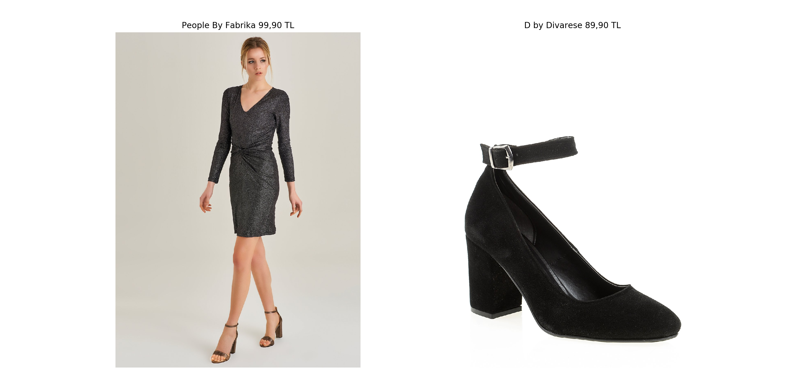
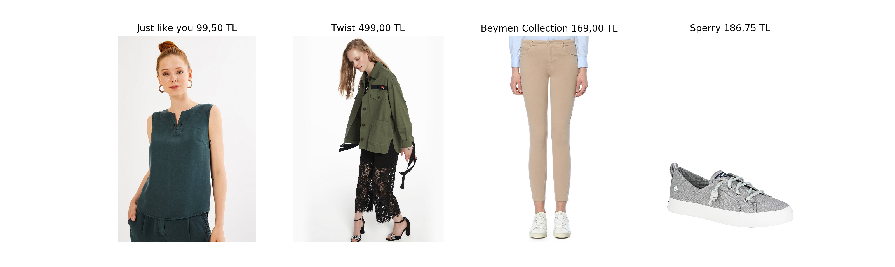
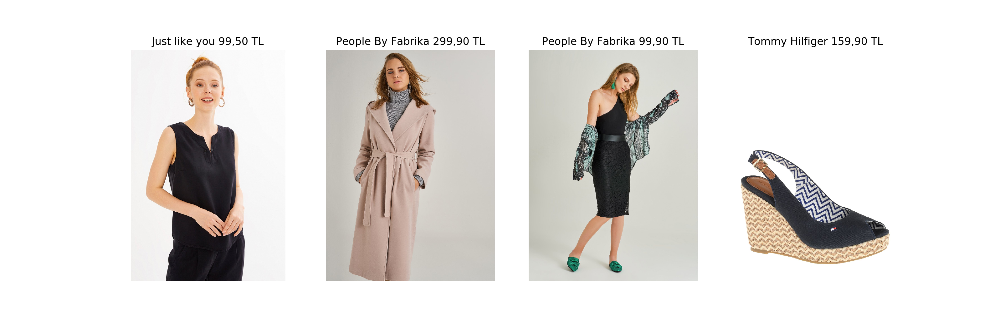
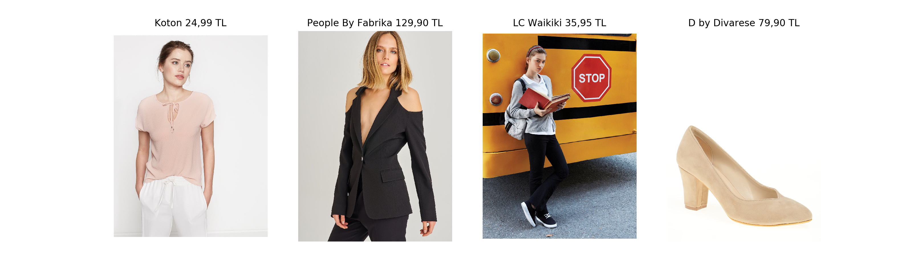
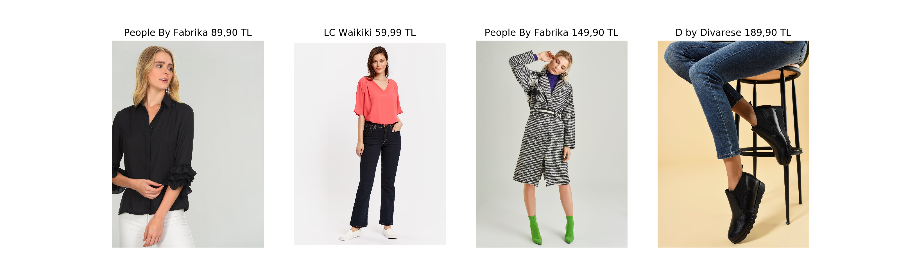
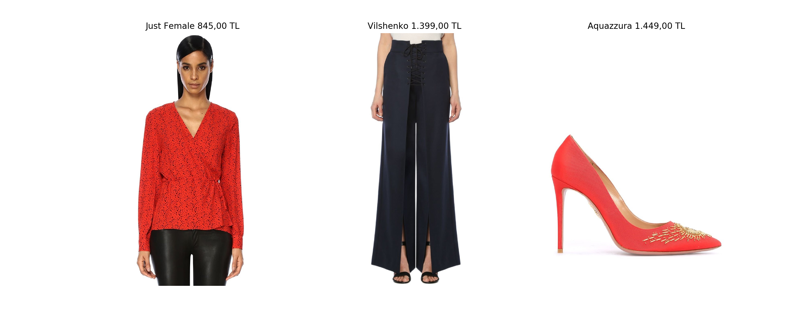

# Complete-Outfit-Recommendation

Example results and references for our complete outfit recommendation system.  
Whole recommendations for each product are available on FashionI app.

These outfits are generated among ~200k clothing products from more than 500 different brands. 

AppStore: https://itunes.apple.com/tr/app/fashioni-find-your-fashion/id1398292864?mt=8  
Google Play: https://play.google.com/store/apps/details?id=com.mobillium.fashioni  

(Code is not publicly available)

References:  
Learning Fashion Compatibility with Bidirectional LSTMs [[PDF]](https://arxiv.org/pdf/1707.05691.pdf)  
["Learning Type-Aware Embeddings for Fashion Compatibility"](https://arxiv.org/pdf/1803.09196.pdf)  
["Outfit Generation and Style Extraction via Bidirectional LSTM and Autoencoder"](https://arxiv.org/pdf/1807.03133.pdf)  
["Explainable Outfit Recommendation with Joint Outfit Matching and Comment Generation"](https://arxiv.org/pdf/1806.08977.pdf)  

Results for Women:
---

---

---

---

---

---

---

---

---

---

---

---

---

---

---
